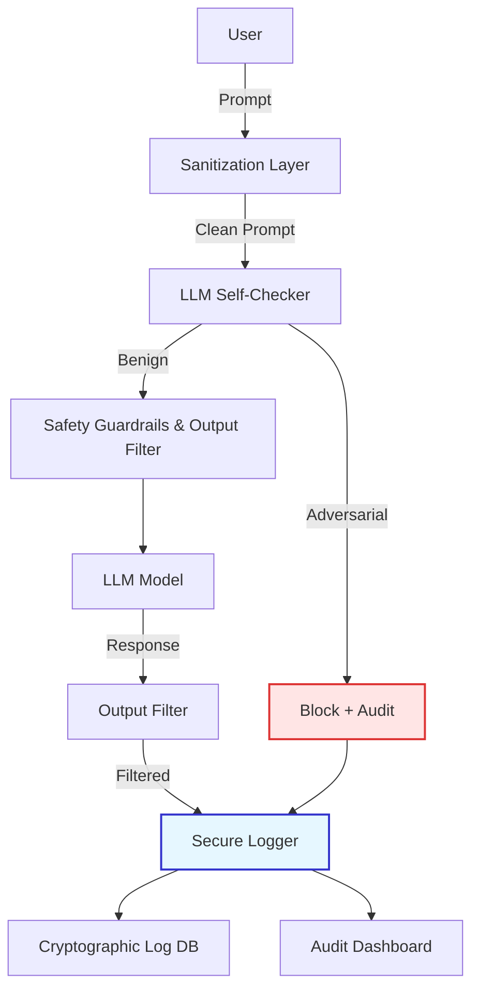
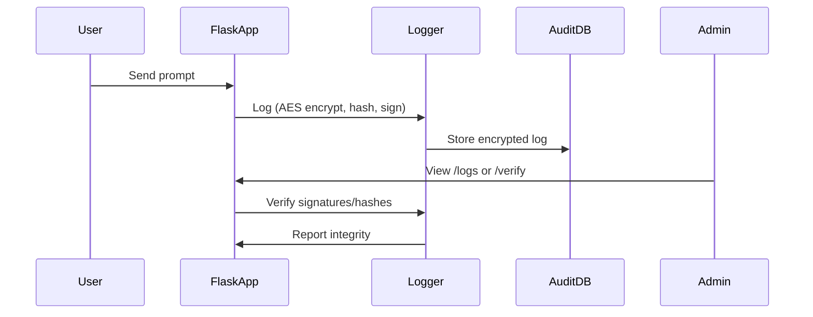
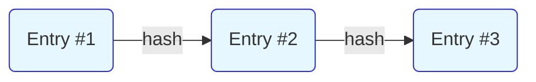

# Prompt Injection Mitigation by Multilayer Cryptographic Security

A grade, research-oriented framework for defending Large Language Model (LLM)-powered applications against prompt injection and adversarial attacks, using a multi-layered approach that combines advanced cryptographic logging, real-time prompt analysis, and secure auditing.

---

## Table of Contents

- [Overview](#overview)
- [System Architecture](#system-architecture)
- [Defense Workflows](#defense-workflows)
- [Cryptographic Logging & Audit Trail](#cryptographic-logging--audit-trail)
- [Setup & Deployment](#setup--deployment)
- [Security Model](#security-model)
- [Screenshots & Diagrams](#screenshots--diagrams)
- [License & Citation](#license--citation)

---

## Overview

This project implements a multi-layer security model for LLM applications, featuring:

- Multi-phase prompt sanitization and adversarial detection
- LLM-powered self-checking for prompt intent classification
- Output filtering and response moderation
- Tamper-evident, encrypted logs with cryptographic chaining and digital signatures
- Secure, auditable, and exportable interaction records

It is designed for security-critical, auditable LLM deployments in enterprise, research, or educational settings.

---

## System Architecture



---

## Defense Workflows

### 1. Prompt Sanitization & Validation

- Regex, heuristics, and blacklist-based detection of injection attempts.
- Rejects prompts containing system-level manipulations or excessive length.

### 2. LLM Self-Checker

- The prompt is analyzed by a secondary "self-checker" LLM using few-shot learning.
- If classified as adversarial or injection-prone, the prompt is blocked and logged for audit.

### 3. Output Filtering

- LLM responses are scanned for sensitive data patterns (e.g., passwords, tokens, secrets), inappropriate content, or evidence of instruction injection.
- Only safe responses are delivered to the user.

### 4. Safety Guardrails

- Prompts are prepended with safety-focused system instructions to reinforce model alignment.

---

## Cryptographic Logging & Audit Trail

- **Encryption:** All prompts and responses are AES-encrypted before storage.
- **Hash Chaining:** Each log entry is linked to its predecessor via SHA-256 hash, forming a tamper-evident chain.
- **Digital Signatures:** Every entry is signed with Ed25519 to ensure authenticity.
- **Audit Dashboard:** Admins can verify log integrity, view/export logs, and detect tampering at a glance.



---

## Setup & Deployment

### Prerequisites

- Python 3.9+
- Docker (recommended for production)
- (Optional) GPU for LLM acceleration

### Quick Docker Start

```bash
git clone https://github.com/TakudzwaChoto/prompt-injection-mitigation-by-multilayer-cryptographic-security.git
cd prompt-injection-mitigation-by-multilayer-cryptographic-security
./run.bat   # Or use 'docker-compose up --build' directly
```

### Manual Local Run

```bash
pip install -r requirements.txt
python app.py
```

### Access the Application

Visit [http://localhost:5000](http://localhost:5000) in your browser.

---

## Security Model

| Layer                   | Purpose                                            | Technology         |
|-------------------------|----------------------------------------------------|--------------------|
| Prompt Sanitization     | Filter out common injection patterns and exploits  | Regex, heuristics  |
| LLM Self-Checker        | Detect subtle adversarial intent                   | LLM (few-shot)     |
| Output Filter           | Block unsafe/inappropriate model outputs           | Regex, heuristics  |
| Guardrails              | Enforce safe assistant behavior                    | Prompt engineering |
| Cryptographic Logger    | Tamper-evident, encrypted, signed audit trail      | AES, SHA-256, Ed25519 |
| Admin Audit             | Real-time verification and export of logs          | Web UI, CSV, SQL   |

---

## Screenshots & Diagrams

### Chat Interface


### Log Audit Dashboard


### Example: Log Chain Structure



---

## License & Citation

This project is intended for research and educational use.  
**License:** *To be specified. Please contact the author for commercial or derivative use.*

**Author:** [Takudzwa Choto](https://github.com/TakudzwaChoto)

> For academic citation, please reference this repository and/or contact the author.

---
